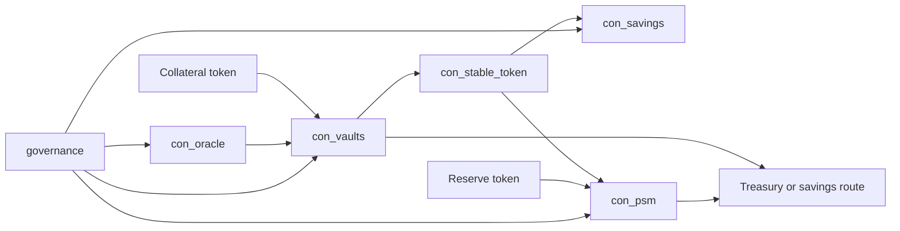

# xian-stable-protocol

`xian-stable-protocol` is a Xian-native redesign of the original
`rubixdao` stablecoin prototype. It implements an overcollateralized
CDP-style stablecoin with a savings vault, a peg-stability module, an
on-chain oracle, and an executable bootstrap path that wires the system
into the Xian stack.

## Protocol Shape



## Status

Strong reference implementation with a real Xian-stack bootstrap path.
**Not** a fully automated production protocol. The main remaining
hardening work is tracked in [docs/ROADMAP.md](docs/ROADMAP.md).

## Quick Start

```bash
uv sync --group dev --group deploy
uv run pytest -q
uv run python scripts/bootstrap_protocol.py
```

The bootstrap script:

- deploys `con_stable_token`, `con_oracle`, `con_savings`, `con_vaults`,
  and `con_psm` if they are missing
- optionally deploys sample `con_collateral_token` and
  `con_reserve_token` contracts for local or staging use
- enables `con_vaults` and `con_psm` as stable-token controllers
- configures oracle reporters and an initial price feed
- sets fee-routing addresses on `con_vaults` and `con_psm`
- seeds a default vault type only when one does not already exist
- uses explicit chi budgets for writes (does not depend on readonly
  simulation being enabled on the target node)
- validates that user-deployed contract names start with `con_`

The operator wallet must match the configured initial governor during
bootstrap. After handoff begins, further governance-managed changes go
through the chain `governance` contract:

```bash
uv run python scripts/bootstrap_protocol.py --start-governance-handoff
```

This only *starts* transfer to the chain `governance` contract.
Acceptance still happens through ordinary governance proposals that call
`accept_governance()` on each protocol contract.

Full operator guidance is in [docs/DEPLOYMENT.md](docs/DEPLOYMENT.md).

## Principles

The protocol keeps the original high-level model:

- overcollateralized vaults mint a stable asset
- vault debt accrues a stability fee
- protocol fees can be routed into a savings pool
- unsafe vaults can be liquidated quickly or auctioned
- governance changes execute through Xian's `masternodes` and
  `governance` contracts
- a peg-stability module offers direct mint and redeem flows against
  reserve assets

But the contracts are intentionally **not** a literal port. They were
redesigned for current Xian / Contracting patterns:

- standard token approvals use a dedicated `approvals` hash
- contracts emit structured `LogEvent`s for indexers and explorers
- the debt engine uses per-type rate accumulators and debt shares
  instead of per-vault ad hoc debt math
- governance is explicit and delayed instead of implicit owner backdoors
- liquidation supports partial cure, auction cancellation, and owner
  cure flows
- auction settlement records bad debt honestly when collateral cannot
  cover system debt
- a surplus buffer and recapitalization path keep protocol losses
  explicit

## Required Wiring

The protocol is not correctly wired unless fee destinations are
configured. The minimum required relationships:

```python
con_stable_token.set_controller(account='con_vaults', enabled=True)
con_stable_token.set_controller(account='con_psm',    enabled=True)

con_vaults.set_savings_contract(target_contract='con_savings')
con_vaults.set_treasury_address(address='treasury')
con_psm.set_treasury_address(address='treasury')
```

If `con_vaults` has no `savings_contract` and no `treasury_address`, or
`con_psm` has no `treasury_address`, fees fall back to the current
governor. That is valid contract behavior but not the intended
production setup.

Day-2 governance-managed surface includes:

- `con_vaults.set_vault_type_auction_config(...)`
- `con_vaults.set_vault_type_surplus_buffer_bps(...)`
- `con_vaults.set_savings_contract(...)`
- `con_vaults.set_treasury_address(...)`
- `con_vaults.claim_refund(...)`
- `con_vaults.liquidate_fast(...)`
- `con_psm.set_treasury_address(...)`
- `con_psm.get_state()`

## Key Directories

- `contracts/` — protocol contracts:
  - `stable_token.s.py` — controller-minted fungible stable asset.
  - `oracle.s.py` — governed multi-reporter oracle with freshness and
    quorum controls.
  - `savings.s.py` — share-based savings vault whose share price
    increases when fees are routed in.
  - `vaults.s.py` — CDP engine: vault types, borrowing, debt-share
    accrual, partial liquidation, auctions, and bad-debt handling.
  - `psm.s.py` — peg-stability module that mints and redeems against
    reserve assets with configurable fees.
  - `members_harness.s.py`, `governance_harness.s.py` — local test
    harnesses for membership and governance.
- `scripts/` — `bootstrap_protocol.py` and helpers.
- `tests/` — contract tests using the local `contracting` runtime.
- `docs/` — architecture, deployment, and roadmap.

## Canonical Contract Names

Current Xian submission rules require user-deployed contracts to start
with `con_`. The bootstrap defaults therefore use:

- `masternodes`, `governance` — chain-managed
- `con_stable_token`, `con_oracle`, `con_savings`, `con_vaults`,
  `con_psm` — protocol contracts
- `con_collateral_token`, `con_reserve_token` — local / staging samples

## Xian Stack Integration

Packaged as a first-class Xian module:

- `xian-configs/modules/stable-protocol/` contains the canonical module
  manifest and pinned contract assets used by `xian-cli`
- `xian-cli` surfaces the module with:
  - `uv run xian module show stable-protocol`
  - `uv run xian module validate stable-protocol`
  - `uv run xian module install stable-protocol --dry-run`
- `xian-deploy/docs/SOLUTIONS.md` describes the recommended remote operator
  posture before running this repo's canonical bootstrap script

The protocol repository remains the canonical bootstrap and operator
entrypoint. The module path lets tooling discover, validate, and delegate to
that bootstrap flow without copying the protocol's deployment logic.

## Validation

```bash
uv sync --group dev
uv run pytest -q
```

The tests cover:

- stable-token controller and allowance flows
- weighted governance using Xian governance semantics
- oracle reporter, quorum, medianization, and freshness behavior
- savings share accounting
- vault creation, closing, fee accrual, collateral withdrawals, and
  debt-share accounting
- partial liquidation and owner-cured auctions
- liquidation auctions with bid extension, bidder refunds, bad-debt
  accounting, and recapitalization
- PSM mint and redeem flows

## Dependency Note

This repository tracks the current `xian-contracting` `main` branch via
`tool.uv.sources` and locks the resolved revision in `uv.lock`. That is
intentional: the protocol targets the latest Xian Contracting event and
runtime behavior, which may move ahead of the last PyPI release.

The optional `deploy` dependency group resolves `xian-py` from the
sibling workspace checkout so the bootstrap script exercises the same
SDK revision the rest of the Xian stack is using.

## Related Docs

- [docs/ARCHITECTURE.md](docs/ARCHITECTURE.md) — major components and dependency direction
- [docs/DEPLOYMENT.md](docs/DEPLOYMENT.md) — operator deployment guide
- [docs/ROADMAP.md](docs/ROADMAP.md) — production-hardening work
- [`../xian-configs/README.md`](../xian-configs/README.md) — module manifests
- [`../xian-cli/README.md`](../xian-cli/README.md) — operator CLI
